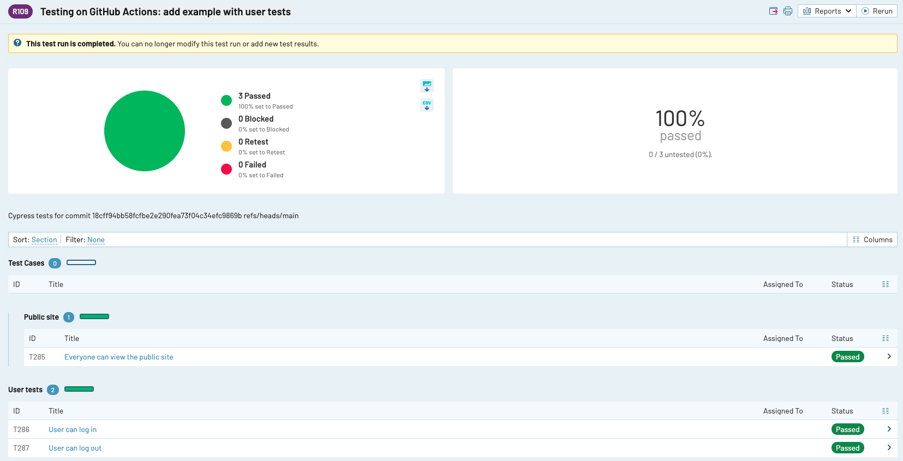
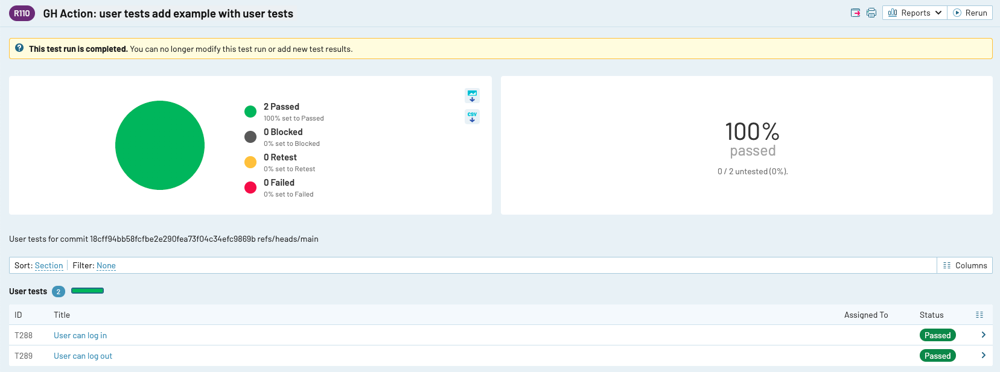

# test-rail-example
 
  [![renovate-app badge][renovate-badge]][renovate-app]
> Trying to use TestRail with Cypress

Read the blog post [Cypress And TestRail](https://glebbahmutov.com/blog/cypress-and-testrail/).

## All tests

See the example workflows [.github/workflows/ci.yml](./.github/workflows/ci.yml) and [.circleci/config.yml](./.circleci/config.yml) that run all specs

## Specific tests

If you need to run only some tests, use the `--spec` parameter to create the test run. It finds the case IDs from those spec files, and adds a new TestRail run using the case list. See the workflow file [.github/workflows/user-tests.yml](./.github/workflows/user-tests.yml)

## Links

- [cypress-testrail-simple](https://github.com/bahmutov/cypress-testrail-simple) with [API key](https://www.gurock.com/testrail/docs/api/getting-started/accessing#username_and_api_key)

## Small print

Author: Gleb Bahmutov &lt;gleb.bahmutov@gmail.com&gt; &copy; 2021

- [@bahmutov](https://twitter.com/bahmutov)
- [glebbahmutov.com](https://glebbahmutov.com)
- [blog](https://glebbahmutov.com/blog)
- [videos](https://www.youtube.com/glebbahmutov)
- [presentations](https://slides.com/bahmutov)
- [cypress.tips](https://cypress.tips)

License: MIT - do anything with the code, but don't blame me if it does not work.

Support: if you find any problems with this module, email / tweet /
[open issue](https://github.com/bahmutov/test-rail-example/issues) on Github

[renovate-badge]: https://img.shields.io/badge/renovate-app-blue.svg
[renovate-app]: https://renovateapp.com/
